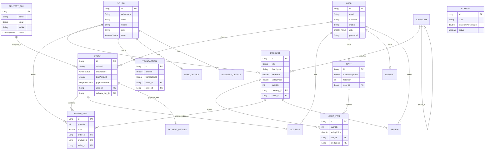

# Annadata — Database Schema & ER Diagram Documentation

This document contains the complete database entity model, entity-relationship (ER) diagram, and relational schema for the **Annadata** multivendor marketplace.

---

## Visual Entity-Relationship (ER) Diagram

---

## Core Relational Schema Tables

### 1. `users` Table
Stores customer, admin, seller, and delivery user accounts.

| Column | Type | Constraints | Description |
|---|---|---|---|
| `id` | `BIGINT` | `PRIMARY KEY`, `AUTO_INCREMENT` | Unique user identifier |
| `email` | `VARCHAR(255)` | `UNIQUE`, `NOT NULL` | User email address |
| `full_name` | `VARCHAR(255)` | `NOT NULL` | Full name |
| `password` | `VARCHAR(255)` | `NOT NULL` | BCrypt hashed password |
| `mobile` | `VARCHAR(20)` | `NULLABLE` | Mobile contact number |
| `role` | `VARCHAR(50)` | `NOT NULL` | Role: `ROLE_CUSTOMER`, `ROLE_ADMIN`, `ROLE_SELLER`, `ROLE_DELIVERY` |

---

### 2. `seller` Table
Stores seller (farmer) profile, GSTIN, business, and verification status.

| Column | Type | Constraints | Description |
|---|---|---|---|
| `id` | `BIGINT` | `PRIMARY KEY`, `AUTO_INCREMENT` | Unique seller identifier |
| `seller_name` | `VARCHAR(255)` | `NOT NULL` | Business / Farmer name |
| `email` | `VARCHAR(255)` | `UNIQUE`, `NOT NULL` | Seller email |
| `mobile` | `VARCHAR(20)` | `NOT NULL` | Seller phone number |
| `gstin` | `VARCHAR(50)` | `NULLABLE` | GST Identification Number |
| `account_status` | `VARCHAR(50)` | `DEFAULT 'PENDING'` | Status: `PENDING_VERIFICATION`, `ACTIVE`, `SUSPENDED`, `BANNED` |

---

### 3. `product` Table
Stores produce items listed by farmers/sellers.

| Column | Type | Constraints | Description |
|---|---|---|---|
| `id` | `BIGINT` | `PRIMARY KEY`, `AUTO_INCREMENT` | Product ID |
| `title` | `VARCHAR(255)` | `NOT NULL` | Product name |
| `description` | `TEXT` | `NULLABLE` | Detailed description |
| `mrp_price` | `DOUBLE` | `NOT NULL` | Maximum retail price |
| `selling_price` | `DOUBLE` | `NOT NULL` | Discounted selling price |
| `quantity` | `INT` | `NOT NULL` | Stock quantity available |
| `category_id` | `BIGINT` | `FOREIGN KEY (category.id)` | Category reference |
| `seller_id` | `BIGINT` | `FOREIGN KEY (seller.id)` | Farmer/Seller reference |

---

### 4. `orders` Table
Stores customer orders.

| Column | Type | Constraints | Description |
|---|---|---|---|
| `id` | `BIGINT` | `PRIMARY KEY`, `AUTO_INCREMENT` | Order ID |
| `order_id` | `VARCHAR(100)` | `UNIQUE` | Human-readable order code |
| `user_id` | `BIGINT` | `FOREIGN KEY (users.id)` | Buyer reference |
| `shipping_address_id` | `BIGINT` | `FOREIGN KEY (address.id)` | Delivery address |
| `total_amount` | `DOUBLE` | `NOT NULL` | Total order amount |
| `order_status` | `VARCHAR(50)` | `NOT NULL` | `PENDING`, `PLACED`, `CONFIRMED`, `SHIPPED`, `DELIVERED`, `CANCELLED` |
| `payment_status` | `VARCHAR(50)` | `NOT NULL` | `PENDING`, `COMPLETED`, `FAILED` |
| `delivery_boy_id` | `BIGINT` | `FOREIGN KEY (delivery_boy.id)` | Assigned delivery person |

---

### 5. `order_item` Table
Stores individual line items within an order.

| Column | Type | Constraints | Description |
|---|---|---|---|
| `id` | `BIGINT` | `PRIMARY KEY`, `AUTO_INCREMENT` | Line item ID |
| `order_id` | `BIGINT` | `FOREIGN KEY (orders.id)` | Parent order |
| `product_id` | `BIGINT` | `FOREIGN KEY (product.id)` | Purchased product |
| `seller_id` | `BIGINT` | `FOREIGN KEY (seller.id)` | Seller fulfilling this item |
| `quantity` | `INT` | `NOT NULL` | Quantity purchased |
| `mrp_price` | `DOUBLE` | `NOT NULL` | Unit MRP |
| `selling_price` | `DOUBLE` | `NOT NULL` | Unit selling price |

---

### 6. `delivery_boy` Table
Stores registered delivery personnel.

| Column | Type | Constraints | Description |
|---|---|---|---|
| `id` | `BIGINT` | `PRIMARY KEY`, `AUTO_INCREMENT` | Delivery person ID |
| `name` | `VARCHAR(255)` | `NOT NULL` | Delivery boy full name |
| `email` | `VARCHAR(255)` | `UNIQUE`, `NOT NULL` | Email |
| `mobile` | `VARCHAR(20)` | `NOT NULL` | Phone number |
| `status` | `VARCHAR(50)` | `DEFAULT 'AVAILABLE'` | `AVAILABLE`, `ON_DELIVERY`, `INACTIVE` |

---

### 7. `transactions` Table
Stores financial payouts and transaction records for seller earnings.

| Column | Type | Constraints | Description |
|---|---|---|---|
| `id` | `BIGINT` | `PRIMARY KEY`, `AUTO_INCREMENT` | Transaction ID |
| `seller_id` | `BIGINT` | `FOREIGN KEY (seller.id)` | Target seller |
| `order_id` | `BIGINT` | `FOREIGN KEY (orders.id)` | Associated order |
| `amount` | `DOUBLE` | `NOT NULL` | Payout amount |
| `date` | `DATETIME` | `NOT NULL` | Transaction timestamp |
